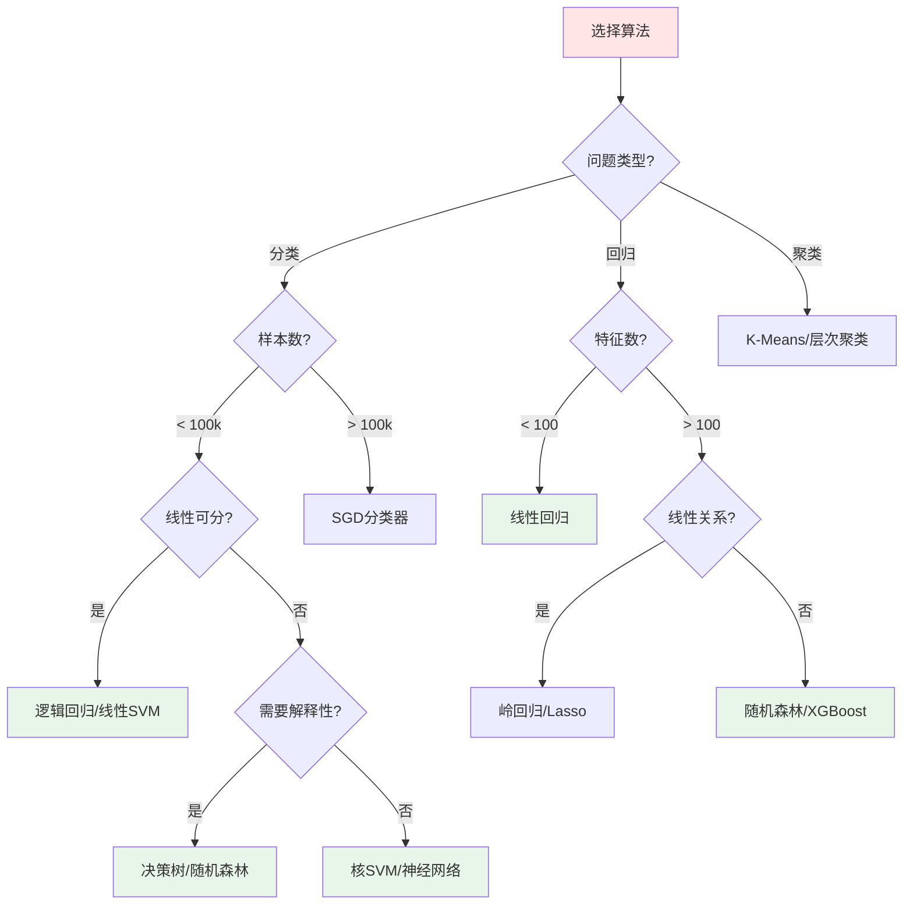

# 第3课：机器学习工作流程

## 📖 课程目标

学完本课，你将能够：
- ✅ 了解完整的机器学习项目流程
- ✅ 理解数据在整个流程中的重要性
- ✅ 掌握数据预处理的基本方法
- ✅ 了解模型评估和部署的要点

**预计学习时间**：45-50分钟  
**难度等级**：⭐⭐ 进阶

---

## 🔄 机器学习项目的完整流程

一个完整的机器学习项目通常包含以下几个阶段：


---

## 1️⃣ 问题定义（Problem Definition）

### 核心问题

**在开始任何工作之前，必须明确以下问题：**

1. **我们要解决什么问题？**
2. **这个问题能用机器学习解决吗？**
3. **解决这个问题的价值是什么？**
4. **我们有什么样的数据？**
5. **如何衡量成功？**

### 示例：垃圾邮件检测项目

| 问题维度 | 具体内容 |
|---------|---------|
| **问题描述** | 自动识别并过滤垃圾邮件 |
| **问题类型** | 监督学习 - 二分类问题 |
| **输入数据** | 邮件文本、发件人、主题等 |
| **输出结果** | 垃圾邮件 / 正常邮件 |
| **成功指标** | 准确率 > 95%，误报率 < 1% |
| **业务价值** | 提升用户体验，减少用户损失 |

### 📝 问题定义清单

在开始项目前，确保回答了以下问题：

```
☑ 问题是否清晰定义？
☑ 是否需要机器学习？（简单规则是否足够？）
☑ 有足够的数据吗？
☑ 数据质量如何？
☑ 如何衡量模型性能？
☑ 预期的投入产出比是多少？
☑ 有哪些约束条件？（时间、成本、隐私）
```

---

## 2️⃣ 数据收集（Data Collection）

### 数据来源

**内部数据源**：
- 🗄️ 公司数据库
- 📊 业务日志
- 📝 用户行为数据
- 💾 传感器数据

**外部数据源**：
- 🌐 公开数据集（Kaggle、UCI、GitHub）
- 🔌 API接口（天气、股票、社交媒体）
- 🕷️ 网络爬虫
- 💰 购买数据

### 数据收集要点

#### 数据量要求

| 问题类型 | 推荐数据量 | 说明 |
|---------|-----------|------|
| 简单分类 | 1,000+ 样本 | 每个类别至少几百个 |
| 复杂分类 | 10,000+ 样本 | 类别越多，需要越多数据 |
| 图像识别 | 10,000+ 图片 | 深度学习需要更多 |
| 文本分类 | 5,000+ 文档 | 依赖任务复杂度 |
| 回归问题 | 1,000+ 样本 | 特征越多，需要越多 |

#### 数据质量要求

✅ **完整性**：数据是否有缺失值？  
✅ **准确性**：数据是否正确？有无错误标注？  
✅ **一致性**：格式是否统一？  
✅ **时效性**：数据是否过时？  
✅ **相关性**：数据是否与问题相关？

### 代码示例：加载数据

```python
import pandas as pd
import numpy as np

# 从CSV文件加载数据
data = pd.read_csv('data/emails.csv')

# 查看数据基本信息
print(f"数据形状: {data.shape}")  # (行数, 列数)
print(f"\n前5行数据:")
print(data.head())

# 数据基本统计
print(f"\n数据统计信息:")
print(data.describe())

# 检查数据类型
print(f"\n数据类型:")
print(data.dtypes)

# 检查缺失值
print(f"\n缺失值统计:")
print(data.isnull().sum())
```

---

## 3️⃣ 数据探索（Data Exploration/EDA）

### 什么是数据探索？

**探索性数据分析（EDA）** 是在建模前了解数据的过程，目的是：
- 📊 了解数据分布
- 🔍 发现数据模式
- 🐛 检测异常值
- 🔗 发现变量间关系

### 数据探索的步骤

#### 步骤1：查看数据概览

```python
# 数据基本信息
print("=" * 50)
print("数据集概览")
print("=" * 50)

# 样本数和特征数
print(f"样本数: {data.shape[0]}")
print(f"特征数: {data.shape[1]}")

# 特征名称
print(f"\n特征列表:")
for i, col in enumerate(data.columns, 1):
    print(f"  {i}. {col} ({data[col].dtype})")
```

#### 步骤2：统计分析

```python
# 数值型特征的统计信息
numerical_cols = data.select_dtypes(include=[np.number]).columns
print("\n数值型特征统计:")
print(data[numerical_cols].describe())

# 类别型特征的统计信息
categorical_cols = data.select_dtypes(include=['object']).columns
print("\n类别型特征统计:")
for col in categorical_cols:
    print(f"\n{col}:")
    print(data[col].value_counts().head())
```

#### 步骤3：可视化分析

```python
import matplotlib.pyplot as plt
import seaborn as sns

# 设置样式
sns.set_style("whitegrid")
plt.rcParams['font.sans-serif'] = ['SimHei']  # 中文支持

# 1. 目标变量分布
plt.figure(figsize=(10, 5))
plt.subplot(1, 2, 1)
data['label'].value_counts().plot(kind='bar', color=['#FF6B6B', '#4ECDC4'])
plt.title('目标变量分布')
plt.xlabel('类别')
plt.ylabel('数量')

# 2. 数值特征分布
plt.subplot(1, 2, 2)
data['feature'].hist(bins=30, edgecolor='black')
plt.title('特征分布')
plt.xlabel('特征值')
plt.ylabel('频数')

plt.tight_layout()
plt.show()

# 3. 相关性矩阵
plt.figure(figsize=(10, 8))
correlation = data[numerical_cols].corr()
sns.heatmap(correlation, annot=True, cmap='coolwarm', center=0)
plt.title('特征相关性矩阵')
plt.show()

# 4. 箱线图（检测异常值）
plt.figure(figsize=(12, 6))
data[numerical_cols].boxplot()
plt.title('箱线图 - 异常值检测')
plt.xticks(rotation=45)
plt.show()
```

### 📊 数据探索发现清单

探索数据时，关注以下问题：

```
📈 数据分布
  ☑ 目标变量是否平衡？
  ☑ 特征值的范围是多少？
  ☑ 是否存在明显的偏态分布？

🐛 数据质量
  ☑ 有多少缺失值？
  ☑ 有异常值吗？
  ☑ 数据是否一致？

🔗 特征关系
  ☑ 特征之间是否高度相关？
  ☑ 哪些特征与目标变量最相关？
  ☑ 是否存在非线性关系？

💡 业务理解
  ☑ 数据是否符合业务逻辑？
  ☑ 是否需要领域专家的帮助？
```

---

## 4️⃣ 数据预处理（Data Preprocessing）

### 为什么需要数据预处理？

**"Garbage In, Garbage Out"** - 垃圾数据只能产生垃圾模型

数据预处理是机器学习中**最耗时但最重要**的步骤，通常占整个项目时间的 **60-80%**。

### 数据预处理的主要任务

#### 1. 处理缺失值

**检测缺失值**：

```python
# 查看缺失值
missing = data.isnull().sum()
missing_percent = 100 * missing / len(data)

missing_df = pd.DataFrame({
    '缺失数量': missing,
    '缺失百分比': missing_percent
})

print(missing_df[missing_df['缺失数量'] > 0].sort_values('缺失数量', ascending=False))
```

**处理策略**：

| 策略 | 适用场景 | 代码示例 |
|------|---------|---------|
| **删除** | 缺失比例 < 5% | `data.dropna()` |
| **均值填充** | 数值型，正态分布 | `data.fillna(data.mean())` |
| **中位数填充** | 数值型，有异常值 | `data.fillna(data.median())` |
| **众数填充** | 类别型特征 | `data.fillna(data.mode()[0])` |
| **前向/后向填充** | 时间序列数据 | `data.fillna(method='ffill')` |
| **预测填充** | 重要特征，缺失少 | 用模型预测缺失值 |

#### 2. 处理异常值

**检测方法**：

```python
# 方法1：统计方法（3倍标准差）
def detect_outliers_zscore(data, column, threshold=3):
    mean = data[column].mean()
    std = data[column].std()
    z_scores = (data[column] - mean) / std
    return data[abs(z_scores) > threshold]

# 方法2：IQR方法（四分位距）
def detect_outliers_iqr(data, column):
    Q1 = data[column].quantile(0.25)
    Q3 = data[column].quantile(0.75)
    IQR = Q3 - Q1
    lower_bound = Q1 - 1.5 * IQR
    upper_bound = Q3 + 1.5 * IQR
    return data[(data[column] < lower_bound) | (data[column] > upper_bound)]

# 使用示例
outliers = detect_outliers_iqr(data, 'price')
print(f"检测到 {len(outliers)} 个异常值")
```

**处理策略**：

- **删除**：确认是错误数据后删除
- **替换**：用均值、中位数或边界值替换
- **保留**：如果是真实极端值，保留并标记
- **单独建模**：为异常值建立单独的模型

#### 3. 特征编码

**类别型特征转数值**：

```python
from sklearn.preprocessing import LabelEncoder, OneHotEncoder

# 方法1：标签编码（有序类别）
# 适用于：教育程度（小学<初中<高中<大学）
le = LabelEncoder()
data['education_encoded'] = le.fit_transform(data['education'])

# 方法2：独热编码（无序类别）
# 适用于：颜色（红、蓝、绿）
data_encoded = pd.get_dummies(data, columns=['color'], prefix='color')

# 方法3：目标编码（类别很多时）
# 用目标变量的均值替换类别
category_means = data.groupby('city')['target'].mean()
data['city_encoded'] = data['city'].map(category_means)
```

#### 4. 特征缩放

**为什么需要缩放？**

不同特征的量纲可能差异巨大：
- 年龄：18-65
- 收入：30,000-500,000

对某些算法（KNN、SVM、神经网络）影响很大。

**缩放方法**：

```python
from sklearn.preprocessing import StandardScaler, MinMaxScaler, RobustScaler

# 方法1：标准化（Z-score normalization）
# 将数据转换为均值0，标准差1
scaler = StandardScaler()
data_scaled = scaler.fit_transform(data[numerical_cols])

# 方法2：归一化（Min-Max scaling）
# 将数据缩放到[0, 1]区间
scaler = MinMaxScaler()
data_scaled = scaler.fit_transform(data[numerical_cols])

# 方法3：鲁棒缩放（Robust scaling）
# 对异常值不敏感
scaler = RobustScaler()
data_scaled = scaler.fit_transform(data[numerical_cols])
```

**选择建议**：

| 算法类型 | 推荐方法 | 原因 |
|---------|---------|------|
| 线性回归、逻辑回归 | 标准化 | 收敛更快 |
| 神经网络 | 标准化 | 梯度下降效果好 |
| SVM、KNN | 归一化或标准化 | 距离计算敏感 |
| 决策树、随机森林 | 不需要 | 基于规则，不受尺度影响 |
| 有异常值 | 鲁棒缩放 | 减少异常值影响 |

#### 5. 数据划分

```python
from sklearn.model_selection import train_test_split

# 划分特征和目标
X = data.drop('target', axis=1)
y = data['target']

# 划分训练集和测试集（80% / 20%）
X_train, X_test, y_train, y_test = train_test_split(
    X, y, 
    test_size=0.2,      # 测试集比例
    random_state=42,    # 随机种子，保证可复现
    stratify=y          # 分层采样，保持类别比例
)

print(f"训练集大小: {X_train.shape}")
print(f"测试集大小: {X_test.shape}")
```

### 完整的预处理流程

```python
from sklearn.pipeline import Pipeline
from sklearn.impute import SimpleImputer
from sklearn.preprocessing import StandardScaler, OneHotEncoder
from sklearn.compose import ColumnTransformer

# 定义数值型特征的处理流程
numerical_transformer = Pipeline(steps=[
    ('imputer', SimpleImputer(strategy='median')),  # 填充缺失值
    ('scaler', StandardScaler())                     # 标准化
])

# 定义类别型特征的处理流程
categorical_transformer = Pipeline(steps=[
    ('imputer', SimpleImputer(strategy='most_frequent')),  # 填充缺失值
    ('onehot', OneHotEncoder(handle_unknown='ignore'))     # 独热编码
])

# 组合所有预处理步骤
preprocessor = ColumnTransformer(
    transformers=[
        ('num', numerical_transformer, numerical_cols),
        ('cat', categorical_transformer, categorical_cols)
    ])

# 应用预处理
X_train_processed = preprocessor.fit_transform(X_train)
X_test_processed = preprocessor.transform(X_test)
```

---

## 5️⃣ 特征工程（Feature Engineering）

### 什么是特征工程？

> "特征工程是机器学习的关键，比算法选择更重要" - Andrew Ng

**特征工程**：从原始数据中创造新特征，提升模型性能。

### 常用特征工程技巧

#### 1. 特征创建

**组合特征**：

```python
# 示例：房价预测
# 创建新特征：总面积 = 卧室面积 + 客厅面积 + 厨房面积
data['total_area'] = data['bedroom_area'] + data['living_area'] + data['kitchen_area']

# 创建比例特征
data['bedroom_ratio'] = data['bedroom_area'] / data['total_area']

# 创建交互特征
data['area_x_quality'] = data['area'] * data['quality_score']
```

**时间特征提取**：

```python
# 从日期提取特征
data['year'] = data['date'].dt.year
data['month'] = data['date'].dt.month
data['day_of_week'] = data['date'].dt.dayofweek
data['is_weekend'] = data['day_of_week'].isin([5, 6]).astype(int)
data['quarter'] = data['date'].dt.quarter
```

**文本特征**：

```python
# 文本长度
data['text_length'] = data['text'].str.len()

# 词数
data['word_count'] = data['text'].str.split().str.len()

# 大写字母比例
data['upper_ratio'] = data['text'].str.count(r'[A-Z]') / data['text_length']
```

#### 2. 特征选择

**为什么需要特征选择？**

- ⚡ **提升性能**：减少噪音特征
- 🚀 **加快训练**：减少计算量
- 💡 **提高可解释性**：更容易理解模型

**方法1：过滤法（Filter）**

```python
from sklearn.feature_selection import SelectKBest, chi2, f_classif

# 选择K个最佳特征（基于卡方检验）
selector = SelectKBest(score_func=chi2, k=10)
X_selected = selector.fit_transform(X, y)

# 查看被选中的特征
selected_features = X.columns[selector.get_support()]
print(f"选中的特征: {list(selected_features)}")
```

**方法2：包裹法（Wrapper）**

```python
from sklearn.feature_selection import RFE
from sklearn.ensemble import RandomForestClassifier

# 递归特征消除
model = RandomForestClassifier(n_estimators=100)
rfe = RFE(estimator=model, n_features_to_select=10)
rfe.fit(X, y)

# 查看特征排名
ranking_df = pd.DataFrame({
    'Feature': X.columns,
    'Ranking': rfe.ranking_
}).sort_values('Ranking')

print(ranking_df)
```

**方法3：嵌入法（Embedded）**

```python
from sklearn.ensemble import RandomForestClassifier

# 基于树模型的特征重要性
model = RandomForestClassifier(n_estimators=100, random_state=42)
model.fit(X_train, y_train)

# 获取特征重要性
feature_importance = pd.DataFrame({
    'Feature': X.columns,
    'Importance': model.feature_importances_
}).sort_values('Importance', ascending=False)

# 可视化
import matplotlib.pyplot as plt
plt.figure(figsize=(10, 6))
plt.barh(feature_importance['Feature'][:10], feature_importance['Importance'][:10])
plt.xlabel('重要性')
plt.title('Top 10 重要特征')
plt.gca().invert_yaxis()
plt.show()
```

---

## 6️⃣ 模型选择（Model Selection）

### 如何选择模型？

选择模型时考虑以下因素：

| 考虑因素 | 问题 |
|---------|------|
| **问题类型** | 分类？回归？聚类？ |
| **数据量** | 样本数够多吗？ |
| **数据维度** | 特征数多吗？ |
| **数据线性性** | 线性可分吗？ |
| **训练时间** | 有时间限制吗？ |
| **可解释性** | 需要解释模型吗？ |
| **准确性要求** | 对性能要求高吗？ |

### 常用算法选择指南



### 从简单到复杂

**推荐策略**：Always start simple!

1. **基线模型**：最简单的模型（如逻辑回归）
2. **改进模型**：尝试更复杂的模型
3. **集成模型**：组合多个模型

```python
from sklearn.linear_model import LogisticRegression
from sklearn.tree import DecisionTreeClassifier
from sklearn.ensemble import RandomForestClassifier, GradientBoostingClassifier
from sklearn.svm import SVC

# 创建多个模型
models = {
    'Logistic Regression': LogisticRegression(),
    'Decision Tree': DecisionTreeClassifier(),
    'Random Forest': RandomForestClassifier(n_estimators=100),
    'Gradient Boosting': GradientBoostingClassifier(),
    'SVM': SVC()
}

# 训练并评估每个模型
for name, model in models.items():
    model.fit(X_train, y_train)
    score = model.score(X_test, y_test)
    print(f"{name}: {score:.4f}")
```

---

## 7️⃣ 模型训练（Model Training）

### 训练过程

```python
from sklearn.ensemble import RandomForestClassifier
from sklearn.model_selection import cross_val_score

# 1. 创建模型
model = RandomForestClassifier(
    n_estimators=100,      # 树的数量
    max_depth=10,          # 树的最大深度
    min_samples_split=5,   # 分裂所需的最小样本数
    random_state=42
)

# 2. 训练模型
print("开始训练...")
model.fit(X_train, y_train)
print("训练完成！")

# 3. 交叉验证
cv_scores = cross_val_score(model, X_train, y_train, cv=5)
print(f"\n5折交叉验证准确率: {cv_scores.mean():.4f} (+/- {cv_scores.std():.4f})")
```

### 超参数调优

**方法1：网格搜索（Grid Search）**

```python
from sklearn.model_selection import GridSearchCV

# 定义超参数网格
param_grid = {
    'n_estimators': [50, 100, 200],
    'max_depth': [5, 10, 15, None],
    'min_samples_split': [2, 5, 10],
    'min_samples_leaf': [1, 2, 4]
}

# 网格搜索
grid_search = GridSearchCV(
    estimator=RandomForestClassifier(random_state=42),
    param_grid=param_grid,
    cv=5,                    # 5折交叉验证
    scoring='accuracy',      # 评估指标
    n_jobs=-1,              # 使用所有CPU核心
    verbose=2               # 显示进度
)

# 执行搜索
grid_search.fit(X_train, y_train)

# 最佳参数
print(f"最佳参数: {grid_search.best_params_}")
print(f"最佳得分: {grid_search.best_score_:.4f}")

# 使用最佳模型
best_model = grid_search.best_estimator_
```

**方法2：随机搜索（Random Search）**

```python
from sklearn.model_selection import RandomizedSearchCV
from scipy.stats import randint, uniform

# 定义参数分布
param_distributions = {
    'n_estimators': randint(50, 300),
    'max_depth': randint(5, 20),
    'min_samples_split': randint(2, 20),
    'min_samples_leaf': randint(1, 10)
}

# 随机搜索
random_search = RandomizedSearchCV(
    estimator=RandomForestClassifier(random_state=42),
    param_distributions=param_distributions,
    n_iter=50,              # 尝试50种组合
    cv=5,
    scoring='accuracy',
    random_state=42,
    n_jobs=-1,
    verbose=2
)

random_search.fit(X_train, y_train)

print(f"最佳参数: {random_search.best_params_}")
print(f"最佳得分: {random_search.best_score_:.4f}")
```

---

## 8️⃣ 模型评估（Model Evaluation）

### 分类模型评估指标

#### 1. 混淆矩阵

```python
from sklearn.metrics import confusion_matrix, classification_report
import seaborn as sns

# 预测
y_pred = model.predict(X_test)

# 混淆矩阵
cm = confusion_matrix(y_test, y_pred)

# 可视化
plt.figure(figsize=(8, 6))
sns.heatmap(cm, annot=True, fmt='d', cmap='Blues')
plt.title('混淆矩阵')
plt.ylabel('真实标签')
plt.xlabel('预测标签')
plt.show()

# 详细报告
print("\n分类报告:")
print(classification_report(y_test, y_pred))
```

#### 2. 评估指标

| 指标 | 公式 | 适用场景 |
|------|------|---------|
| **准确率** | (TP+TN)/(TP+TN+FP+FN) | 类别平衡时 |
| **精确率** | TP/(TP+FP) | 关注误报率 |
| **召回率** | TP/(TP+FN) | 关注漏报率 |
| **F1分数** | 2×精确率×召回率/(精确率+召回率) | 综合考虑 |
| **AUC-ROC** | ROC曲线下面积 | 评估整体性能 |

```python
from sklearn.metrics import accuracy_score, precision_score, recall_score, f1_score, roc_auc_score

# 计算各项指标
accuracy = accuracy_score(y_test, y_pred)
precision = precision_score(y_test, y_pred, average='weighted')
recall = recall_score(y_test, y_pred, average='weighted')
f1 = f1_score(y_test, y_pred, average='weighted')

print(f"准确率: {accuracy:.4f}")
print(f"精确率: {precision:.4f}")
print(f"召回率: {recall:.4f}")
print(f"F1分数: {f1:.4f}")

# ROC曲线
from sklearn.metrics import roc_curve, auc
y_pred_proba = model.predict_proba(X_test)[:, 1]
fpr, tpr, thresholds = roc_curve(y_test, y_pred_proba)
roc_auc = auc(fpr, tpr)

plt.figure(figsize=(8, 6))
plt.plot(fpr, tpr, color='darkorange', lw=2, label=f'ROC curve (AUC = {roc_auc:.2f})')
plt.plot([0, 1], [0, 1], color='navy', lw=2, linestyle='--')
plt.xlim([0.0, 1.0])
plt.ylim([0.0, 1.05])
plt.xlabel('假正率 (False Positive Rate)')
plt.ylabel('真正率 (True Positive Rate)')
plt.title('ROC曲线')
plt.legend(loc="lower right")
plt.show()
```

### 回归模型评估指标

```python
from sklearn.metrics import mean_squared_error, mean_absolute_error, r2_score

# 预测
y_pred = model.predict(X_test)

# 计算指标
mse = mean_squared_error(y_test, y_pred)
rmse = np.sqrt(mse)
mae = mean_absolute_error(y_test, y_pred)
r2 = r2_score(y_test, y_pred)

print(f"均方误差 (MSE): {mse:.4f}")
print(f"均方根误差 (RMSE): {rmse:.4f}")
print(f"平均绝对误差 (MAE): {mae:.4f}")
print(f"R² 分数: {r2:.4f}")

# 可视化预测结果
plt.figure(figsize=(10, 6))
plt.scatter(y_test, y_pred, alpha=0.5)
plt.plot([y_test.min(), y_test.max()], [y_test.min(), y_test.max()], 'r--', lw=2)
plt.xlabel('真实值')
plt.ylabel('预测值')
plt.title('真实值 vs 预测值')
plt.show()
```

---

## 9️⃣ 模型部署（Model Deployment）

### 保存模型

```python
import joblib
import pickle

# 方法1：使用joblib（推荐）
joblib.dump(model, 'model.joblib')

# 方法2：使用pickle
with open('model.pkl', 'wb') as f:
    pickle.dump(model, f)

# 加载模型
loaded_model = joblib.load('model.joblib')

# 使用加载的模型
predictions = loaded_model.predict(new_data)
```

### 部署方式

#### 1. 批量预测

```python
# 定期批量处理
def batch_predict(data_file, model_file, output_file):
    # 加载模型
    model = joblib.load(model_file)
    
    # 加载新数据
    new_data = pd.read_csv(data_file)
    
    # 预处理
    X_new = preprocessor.transform(new_data)
    
    # 预测
    predictions = model.predict(X_new)
    
    # 保存结果
    new_data['prediction'] = predictions
    new_data.to_csv(output_file, index=False)
    
    return predictions
```

#### 2. 实时预测（API）

```python
from flask import Flask, request, jsonify
import joblib

app = Flask(__name__)

# 加载模型
model = joblib.load('model.joblib')
preprocessor = joblib.load('preprocessor.joblib')

@app.route('/predict', methods=['POST'])
def predict():
    try:
        # 获取输入数据
        data = request.get_json()
        
        # 转换为DataFrame
        df = pd.DataFrame([data])
        
        # 预处理
        X = preprocessor.transform(df)
        
        # 预测
        prediction = model.predict(X)[0]
        probability = model.predict_proba(X)[0].tolist()
        
        # 返回结果
        return jsonify({
            'prediction': int(prediction),
            'probability': probability,
            'success': True
        })
    
    except Exception as e:
        return jsonify({
            'error': str(e),
            'success': False
        }), 400

if __name__ == '__main__':
    app.run(debug=True, port=5000)
```

**调用API**：

```python
import requests

# 准备数据
data = {
    'feature1': 25,
    'feature2': 'A',
    'feature3': 100.5
}

# 发送请求
response = requests.post('http://localhost:5000/predict', json=data)

# 获取结果
result = response.json()
print(f"预测结果: {result['prediction']}")
print(f"概率: {result['probability']}")
```

---

## 🔟 监控维护（Monitoring & Maintenance）

### 为什么需要监控？

模型上线后可能面临的问题：
- 📉 **性能下降**：数据分布变化
- 🐛 **数据质量**：异常输入
- ⚡ **响应延迟**：系统负载
- 🔒 **安全问题**：恶意输入

### 监控内容

#### 1. 性能监控

```python
import time
from datetime import datetime

class ModelMonitor:
    def __init__(self):
        self.predictions = []
        self.latencies = []
        self.errors = []
    
    def log_prediction(self, input_data, prediction, actual=None):
        start_time = time.time()
        
        # 记录预测
        log_entry = {
            'timestamp': datetime.now(),
            'prediction': prediction,
            'actual': actual,
            'latency': time.time() - start_time
        }
        
        self.predictions.append(log_entry)
        
        # 如果有实际值，计算准确率
        if actual is not None:
            is_correct = (prediction == actual)
            return is_correct
    
    def get_statistics(self):
        # 计算统计信息
        if len(self.predictions) == 0:
            return None
        
        correct = sum(1 for p in self.predictions if p.get('actual') and p['prediction'] == p['actual'])
        total = sum(1 for p in self.predictions if p.get('actual'))
        
        return {
            'total_predictions': len(self.predictions),
            'accuracy': correct / total if total > 0 else None,
            'avg_latency': np.mean(self.latencies) if self.latencies else None
        }

# 使用监控
monitor = ModelMonitor()

# 记录预测
monitor.log_prediction(input_data, prediction, actual_label)

# 查看统计
stats = monitor.get_statistics()
print(stats)
```

#### 2. 数据漂移检测

```python
from scipy.stats import ks_2samp

def detect_data_drift(reference_data, current_data, threshold=0.05):
    """
    使用K-S检验检测数据漂移
    """
    results = {}
    
    for column in reference_data.columns:
        # K-S检验
        statistic, p_value = ks_2samp(
            reference_data[column],
            current_data[column]
        )
        
        # 判断是否漂移
        is_drift = p_value < threshold
        
        results[column] = {
            'statistic': statistic,
            'p_value': p_value,
            'is_drift': is_drift
        }
    
    return results

# 使用示例
drift_results = detect_data_drift(training_data, production_data)

# 报警
for feature, result in drift_results.items():
    if result['is_drift']:
        print(f"⚠️ 警告: 特征 '{feature}' 发生数据漂移！")
```

### 模型更新策略

1. **定期重训练**：每周/月用新数据重新训练
2. **在线学习**：持续从新数据中学习
3. **A/B测试**：同时运行多个模型版本
4. **渐进式更新**：逐步替换旧模型

---

## 📊 完整项目示例

### 房价预测项目

```python
import pandas as pd
import numpy as np
from sklearn.model_selection import train_test_split
from sklearn.preprocessing import StandardScaler
from sklearn.ensemble import RandomForestRegressor
from sklearn.metrics import mean_squared_error, r2_score
import joblib

# ========== 1. 问题定义 ==========
# 目标：根据房屋特征预测房价
# 类型：回归问题
# 指标：RMSE、R²

# ========== 2. 数据收集 ==========
data = pd.read_csv('housing_data.csv')
print(f"数据形状: {data.shape}")

# ========== 3. 数据探索 ==========
print("\n数据概览:")
print(data.head())
print("\n统计信息:")
print(data.describe())
print("\n缺失值:")
print(data.isnull().sum())

# ========== 4. 数据预处理 ==========
# 处理缺失值
data = data.dropna()

# 特征和目标分离
X = data.drop('price', axis=1)
y = data['price']

# 划分数据集
X_train, X_test, y_train, y_test = train_test_split(
    X, y, test_size=0.2, random_state=42
)

# 特征缩放
scaler = StandardScaler()
X_train_scaled = scaler.fit_transform(X_train)
X_test_scaled = scaler.transform(X_test)

# ========== 5. 特征工程 ==========
# （根据需要添加）

# ========== 6. 模型选择 ==========
model = RandomForestRegressor(
    n_estimators=100,
    max_depth=10,
    random_state=42
)

# ========== 7. 模型训练 ==========
print("\n开始训练...")
model.fit(X_train_scaled, y_train)
print("训练完成！")

# ========== 8. 模型评估 ==========
y_train_pred = model.predict(X_train_scaled)
y_test_pred = model.predict(X_test_scaled)

train_rmse = np.sqrt(mean_squared_error(y_train, y_train_pred))
test_rmse = np.sqrt(mean_squared_error(y_test, y_test_pred))
train_r2 = r2_score(y_train, y_train_pred)
test_r2 = r2_score(y_test, y_test_pred)

print(f"\n训练集 RMSE: {train_rmse:.2f}")
print(f"测试集 RMSE: {test_rmse:.2f}")
print(f"训练集 R²: {train_r2:.4f}")
print(f"测试集 R²: {test_r2:.4f}")

# ========== 9. 模型部署 ==========
# 保存模型
joblib.dump(model, 'housing_model.joblib')
joblib.dump(scaler, 'scaler.joblib')
print("\n模型已保存！")

# ========== 10. 使用模型 ==========
def predict_price(features):
    """预测房价"""
    model = joblib.load('housing_model.joblib')
    scaler = joblib.load('scaler.joblib')
    
    features_scaled = scaler.transform([features])
    prediction = model.predict(features_scaled)[0]
    
    return prediction

# 测试
new_house = [2000, 3, 2, 2010, 5000]  # 面积、卧室、浴室、年份、地块
predicted_price = predict_price(new_house)
print(f"\n预测房价: ${predicted_price:,.2f}")
```

---

## 📝 课后练习

### 选择题

#### 1. 机器学习项目中最耗时的步骤通常是？

```quiz-json
{
  "question": "机器学习项目中最耗时的步骤通常是？",
  "type": "single",
  "options": [
    {
      "id": "a",
      "text": "模型选择",
      "isCorrect": false
    },
    {
      "id": "b",
      "text": "数据预处理和特征工程",
      "isCorrect": true
    },
    {
      "id": "c",
      "text": "模型训练",
      "isCorrect": false
    },
    {
      "id": "d",
      "text": "模型部署",
      "isCorrect": false
    }
  ],
  "explanation": "数据预处理和特征工程通常占据整个项目60-80%的时间。高质量的数据和特征是模型成功的关键，需要大量时间进行清洗、转换和创建新特征。"
}
```

#### 2. 处理缺失值时，哪种情况适合使用中位数填充？

```quiz-json
{
  "question": "处理缺失值时，哪种情况适合使用中位数填充？",
  "type": "single",
  "options": [
    {
      "id": "a",
      "text": "类别型特征",
      "isCorrect": false
    },
    {
      "id": "b",
      "text": "数值型特征，且数据呈正态分布",
      "isCorrect": false
    },
    {
      "id": "c",
      "text": "数值型特征，且数据中有异常值",
      "isCorrect": true
    },
    {
      "id": "d",
      "text": "时间序列数据",
      "isCorrect": false
    }
  ],
  "explanation": "当数据中存在异常值时，中位数比均值更稳健。异常值会显著影响均值，但对中位数的影响较小，因此中位数填充更适合有异常值的情况。"
}
```

#### 3. 特征缩放对哪些算法最重要？

```quiz-json
{
  "question": "特征缩放对哪些算法最重要？",
  "type": "multiple",
  "options": [
    {
      "id": "a",
      "text": "线性回归",
      "isCorrect": true
    },
    {
      "id": "b",
      "text": "决策树",
      "isCorrect": false
    },
    {
      "id": "c",
      "text": "K近邻(KNN)",
      "isCorrect": true
    },
    {
      "id": "d",
      "text": "支持向量机(SVM)",
      "isCorrect": true
    },
    {
      "id": "e",
      "text": "随机森林",
      "isCorrect": false
    }
  ],
  "explanation": "基于距离的算法(KNN、SVM)和梯度下降优化的算法(线性回归、神经网络)对特征尺度敏感。而基于树的算法(决策树、随机森林)不受特征尺度影响，因为它们基于特征值的相对顺序进行分裂。"
}
```

#### 4. 下列哪些是评估分类模型的指标？

```quiz-json
{
  "question": "下列哪些是评估分类模型的指标？",
  "type": "multiple",
  "options": [
    {
      "id": "a",
      "text": "准确率(Accuracy)",
      "isCorrect": true
    },
    {
      "id": "b",
      "text": "F1分数",
      "isCorrect": true
    },
    {
      "id": "c",
      "text": "均方误差(MSE)",
      "isCorrect": false
    },
    {
      "id": "d",
      "text": "AUC-ROC",
      "isCorrect": true
    },
    {
      "id": "e",
      "text": "R²分数",
      "isCorrect": false
    }
  ],
  "explanation": "准确率、F1分数和AUC-ROC是分类问题的评估指标。MSE和R²分数是回归问题的评估指标，不适用于分类问题。"
}
```

#### 5. 数据漂移(Data Drift)指的是什么？

```quiz-json
{
  "question": "数据漂移(Data Drift)指的是什么？",
  "type": "single",
  "options": [
    {
      "id": "a",
      "text": "训练数据中的缺失值",
      "isCorrect": false
    },
    {
      "id": "b",
      "text": "生产环境中的数据分布与训练数据不同",
      "isCorrect": true
    },
    {
      "id": "c",
      "text": "模型预测错误",
      "isCorrect": false
    },
    {
      "id": "d",
      "text": "数据存储错误",
      "isCorrect": false
    }
  ],
  "explanation": "数据漂移是指生产环境中的数据分布随时间发生变化，与训练时的数据分布不同。这会导致模型性能下降，需要监控并定期重新训练模型。"
}
```

### 实践题

#### 6. 完整的数据预处理流程

编写代码完成以下数据预处理任务：
1. 加载数据
2. 检查缺失值并处理
3. 处理异常值
4. 特征编码
5. 特征缩放
6. 划分数据集

#### 7. 模型比较

使用同一数据集训练以下模型并比较性能：
- 逻辑回归
- 决策树
- 随机森林
- 支持向量机

绘制性能对比图表。

#### 8. 特征重要性分析

训练一个随机森林模型，分析并可视化特征重要性，找出对预测最重要的前10个特征。

---

## 🎯 学习要点总结

### 核心流程记忆

```
🎯 问题定义 → 明确目标和成功标准
📊 数据收集 → 获取足够质量的数据
🔍 数据探索 → 了解数据分布和特征
🧹 数据预处理 → 清洗和转换数据
⚙️ 特征工程 → 创造和选择最佳特征
🤖 模型选择 → 根据问题选择算法
📚 模型训练 → 训练并调优模型
📈 模型评估 → 用合适指标评估性能
🚀 模型部署 → 将模型投入生产
👀 监控维护 → 持续监控和更新
```

### 关键要点

1. **数据质量决定模型上限**
   - Garbage In, Garbage Out
   - 数据预处理占60-80%时间

2. **从简单开始**
   - 先建立基线模型
   - 逐步增加复杂度

3. **特征工程很重要**
   - 好的特征 > 复杂的算法
   - 领域知识至关重要

4. **选择合适的评估指标**
   - 不同问题用不同指标
   - 考虑业务目标

5. **模型需要持续维护**
   - 监控性能变化
   - 定期更新模型

---

## 📚 延伸阅读

### 推荐资源

**书籍**：
- 《机器学习实战》
- 《Python机器学习》
- 《特征工程入门与实践》

**在线资源**：
- Scikit-learn官方文档
- Kaggle竞赛和教程
- Google ML Crash Course

**实践项目**：
- Kaggle入门竞赛
- UCI机器学习数据集
- 自己的实际问题

### 下一步学习

**推荐学习路径**：

1. ✅ **已完成**：了解完整流程
2. 📖 **下一步**：深入学习数据集划分
3. 🎯 **后续**：学习各类算法细节
4. 💪 **进阶**：参与实际项目

---

## ✅ 下节预告

**第4课：训练集、验证集、测试集**

下一课我们将详细学习：
- 为什么要划分数据集
- 如何正确划分数据集
- 交叉验证的原理和应用
- 避免数据泄露的技巧

**预习任务**：
- 思考：为什么不能直接用训练数据评估模型？
- 了解：什么是过拟合和欠拟合？
- 准备：一个想要解决的实际问题

---

**恭喜你完成第3课！** 🎉

你现在已经掌握了完整的机器学习工作流程。记住，实践是最好的学习方式，快去动手试试吧！💪

