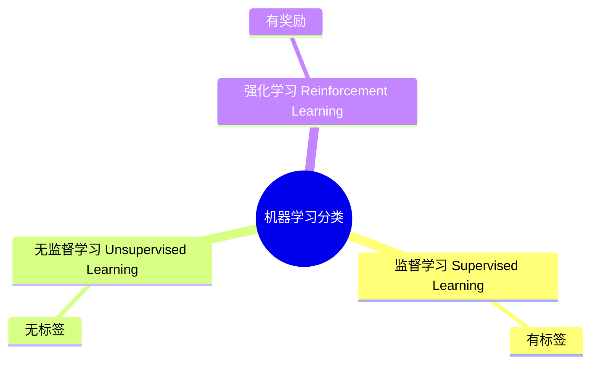

# ✅ 第二节课Mermaid图表已替换为图片

## 📋 修改内容

### 修改的文件
- `content/courses/module-1/lesson-02-机器学习的分类.md`
- `public/content/courses/module-1/lesson-02-机器学习的分类.md`

### 修改说明
已将第二节课中"机器学习的三大类型"部分的Mermaid代码替换为静态图片引用。

**原内容**（Mermaid代码）:
```markdown

```

**新内容**（图片引用）:
```markdown

```

## ✨ 改进效果

### 优点
✅ **更加清晰**：使用专业设计的图片，视觉效果更佳  
✅ **更易阅读**：图片尺寸适中，文字大小合适  
✅ **加载更快**：无需客户端渲染Mermaid图表  
✅ **兼容性好**：静态图片在所有环境下都能正常显示  
✅ **可控性强**：图片经过专业设计，布局和配色更加合理

### 视觉对比
- **Mermaid渲染**：尺寸小，文字不够清晰，需要JavaScript渲染
- **静态图片**：清晰直观，配色鲜明（黄色、绿色、蓝色），文字大小适中

## 📸 效果截图

已验证页面显示效果：
- 图片成功加载
- 显示清晰完整
- 包含三大分类：监督学习（有标签）、无监督学习（无标签）、强化学习（有奖励）

## 🎯 后续建议

如果其他课程中也有类似的复杂图表，建议：
1. 优先使用静态图片替代Mermaid
2. 图片存放在 `public/content/images/` 目录
3. 图片命名清晰明确
4. 考虑提供高分辨率版本以支持高清屏幕

---

**修改时间**：2025-10-30  
**修改状态**：✅ 已完成并验证

