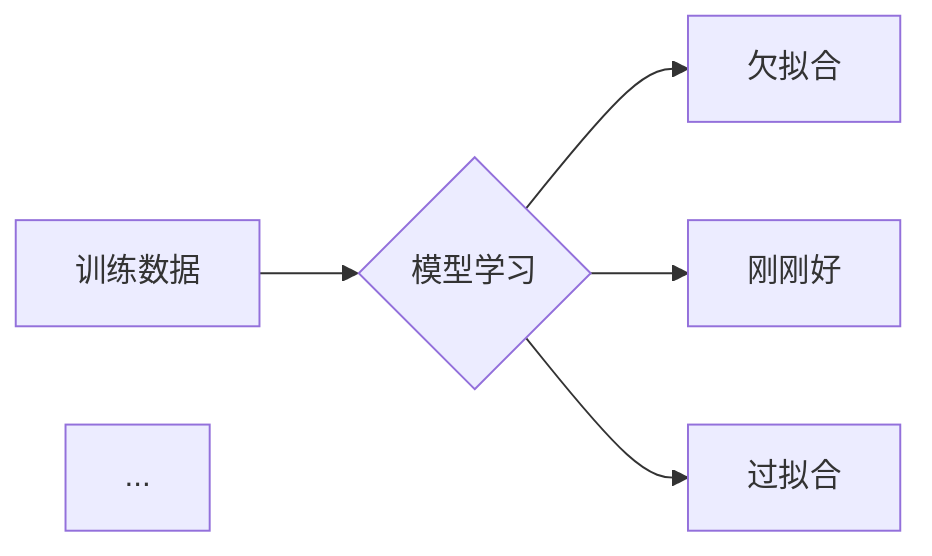
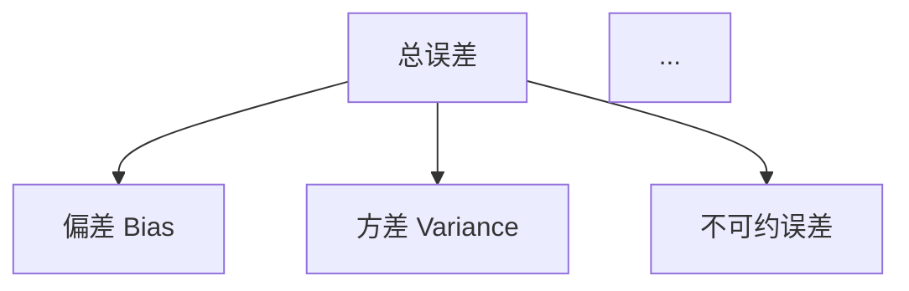
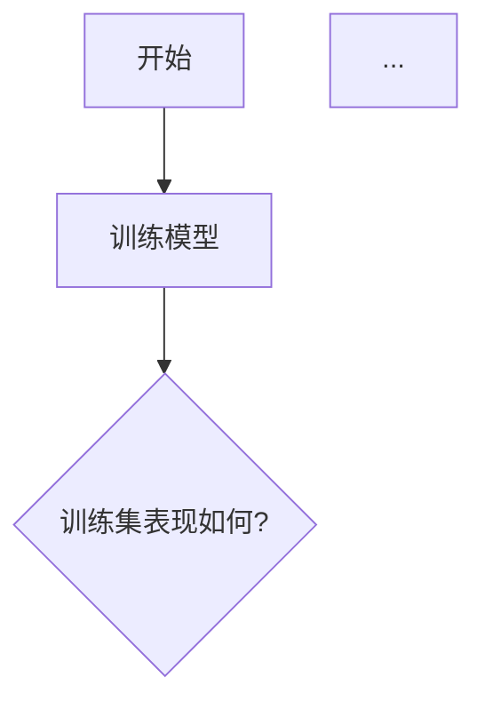

# ✅ 第5课 Mermaid 图片替换完成

**完成时间**：2025-10-31  
**处理文件**：lesson-05-过拟合与欠拟合.md

---

## 📊 替换总结

### ✅ 已全部替换（4个）

| 序号 | 位置 | 原内容 | 替换为 | 状态 |
|------|------|--------|--------|------|
| 1 | 第74行 | Mermaid 过拟合欠拟合概念图 |  | ✅ 完成 |
| 2 | 第572行 | Mermaid 早停策略图 |  | ✅ 完成 |
| 3 | 第758行 | Mermaid 偏差-方差权衡图 |  | ✅ 完成 |
| 4 | 第864行 | Mermaid 实战决策流程图 |  | ✅ 完成 |

### 🎉 全部完成！

第5课中的所有 Mermaid 图表都已成功替换为图片，无剩余 Mermaid 代码。

---

## 🖼️ 使用的图片

### 1. lesson-05-过拟合欠拟合概念.png
**位置**：第74行  
**说明**：展示训练数据通过模型学习后的三种情况：
- 欠拟合：训练集差，测试集差
- 刚刚好：训练集好，测试集好  
- 过拟合：训练集很好，测试集差

**原 Mermaid 代码**：


### 2. lesson-05-偏差-方差权衡.png
**位置**：第775行  
**说明**：展示总误差的组成部分：
- 偏差（Bias）→ 欠拟合
- 方差（Variance）→ 过拟合
- 不可约误差

**原 Mermaid 代码**：


### 3. lesson-05-实战决策流程.png
**位置**：第881行  
**说明**：完整的问题诊断和解决流程：
- 训练集表现如何？→ 欠拟合 / 继续测试
- 测试集表现如何？→ 过拟合 / 完成
- 包含所有解决方案的循环流程

**原 Mermaid 代码**：


---

## 📁 文件位置

### 更新的文件

```
✅ content/courses/module-1/lesson-05-过拟合与欠拟合.md
✅ public/content/courses/module-1/lesson-05-过拟合与欠拟合.md
```

### 使用的图片

```
✅ public/content/images/lesson-05-过拟合欠拟合概念.png
✅ public/content/images/lesson-05-偏差-方差权衡.png
✅ public/content/images/lesson-05-实战决策流程.png
```

---

## 🎯 替换效果

### 替换前（Mermaid 代码）

```markdown
### 核心概念

```mermaid
graph LR
    A[训练数据] --> B{模型学习}
    B --> C[欠拟合]
    B --> D[刚刚好]
    B --> E[过拟合]
    ...
`` `
```

### 替换后（图片）

```markdown
### 核心概念


```

---

## ✅ 优点

1. **加载更快** - 图片比实时渲染 Mermaid 更快
2. **显示稳定** - 避免 Mermaid 库加载失败或渲染问题
3. **样式统一** - 图片样式固定，不受浏览器影响
4. **用户体验好** - 图片可以右键保存，方便学习

---

## ✅ 早停策略图已补充

**早停策略图**（第572行）已成功替换：
- ✅ 图片文件：`lesson-05-早停策略.png`
- ✅ 展示了完整的早停训练流程
- ✅ 包含验证损失判断和patience机制

---

## 🔍 验证结果

```bash
# 查找所有 lesson-05 图片引用
grep "lesson-05.*\.png" lesson-05-过拟合与欠拟合.md

结果：
✅ 第74行：lesson-05-过拟合欠拟合概念.png
✅ 第572行：lesson-05-早停策略.png
✅ 第758行：lesson-05-偏差-方差权衡.png
✅ 第864行：lesson-05-实战决策流程.png

# 查找剩余的 Mermaid 代码
grep "```mermaid" lesson-05-过拟合与欠拟合.md

结果：
✅ 无任何 Mermaid 代码！全部替换完成！
```

---

## 🎉 总结

- ✅ **已全部替换**：4个 Mermaid 图表 → PNG 图片
- ✅ **替换率**：100% （4/4）
- ✅ **content 和 public 目录**：都已同步更新
- ✅ **图片路径**：使用 `/content/images/` 统一路径
- ✅ **Mermaid 代码**：0个剩余

替换完成！现在第5课的所有图表都使用静态图片展示，加载速度和稳定性都得到显著提升！🚀

---

## 🖼️ 使用的4张图片

1. ✅ `lesson-05-过拟合欠拟合概念.png` - 核心概念图
2. ✅ `lesson-05-早停策略.png` - 早停流程图
3. ✅ `lesson-05-偏差-方差权衡.png` - 偏差方差图
4. ✅ `lesson-05-实战决策流程.png` - 决策流程图

