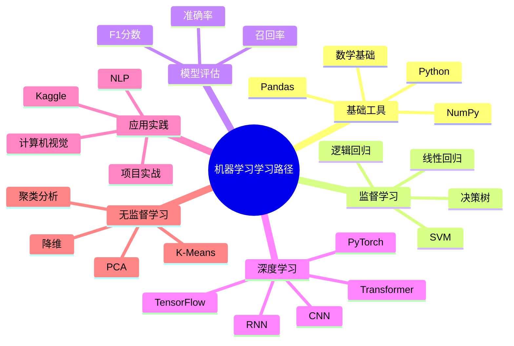

# 机器学习知识图谱 - Mermaid 代码

## 使用方法
1. 复制下面的 Mermaid 代码
2. 访问 https://mermaid.live/
3. 粘贴代码到编辑器
4. 导出图片

## Mermaid 代码

```mermaid
mindmap
  root((机器学习学习路径))
    基础工具
      Python
      NumPy
      Pandas
      数学基础
    监督学习
      线性回归
      逻辑回归
      决策树
      SVM
    模型评估
      准确率
      召回率
      F1分数
    深度学习
      CNN
      RNN
      Transformer
      TensorFlow
      PyTorch
    应用实践
      计算机视觉
      NLP
      Kaggle
      项目实战
    无监督学习
      K-Means
      聚类分析
      PCA
      降维
```

## 备用方案（如果mindmap不支持）

使用graph格式：

```mermaid
graph TD
    A[机器学习学习路径]
    
    A --> B[基础工具]
    B --> B1[Python]
    B --> B2[NumPy]
    B --> B3[Pandas]
    B --> B4[数学基础]
    
    A --> C[监督学习]
    C --> C1[线性回归]
    C --> C2[逻辑回归]
    C --> C3[决策树]
    C --> C4[SVM]
    
    A --> D[模型评估]
    D --> D1[准确率]
    D --> D2[召回率]
    D --> D3[F1分数]
    
    A --> E[深度学习]
    E --> E1[CNN]
    E --> E2[RNN]
    E --> E3[Transformer]
    E --> E4[TensorFlow]
    E --> E5[PyTorch]
    
    A --> F[应用实践]
    F --> F1[计算机视觉]
    F --> F2[NLP]
    F --> F3[Kaggle]
    F --> F4[项目实战]
    
    A --> G[无监督学习]
    G --> G1[K-Means]
    G --> G2[聚类分析]
    G --> G3[PCA]
    G --> G4[降维]
    
    style A fill:#3b82f6,stroke:#1e40af,color:#fff
    style B fill:#fbbf24,stroke:#d97706
    style C fill:#34d399,stroke:#059669
    style D fill:#a3e635,stroke:#65a30d
    style E fill:#a78bfa,stroke:#7c3aed
    style F fill:#f472b6,stroke:#db2777
    style G fill:#fb7185,stroke:#e11d48
```

