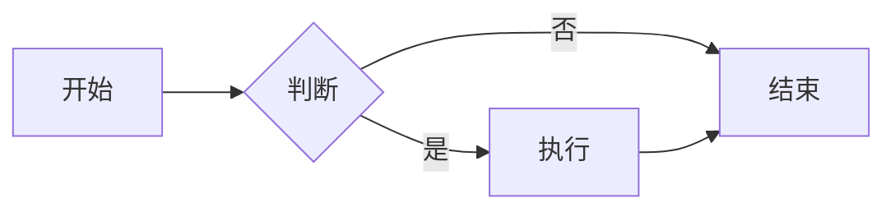
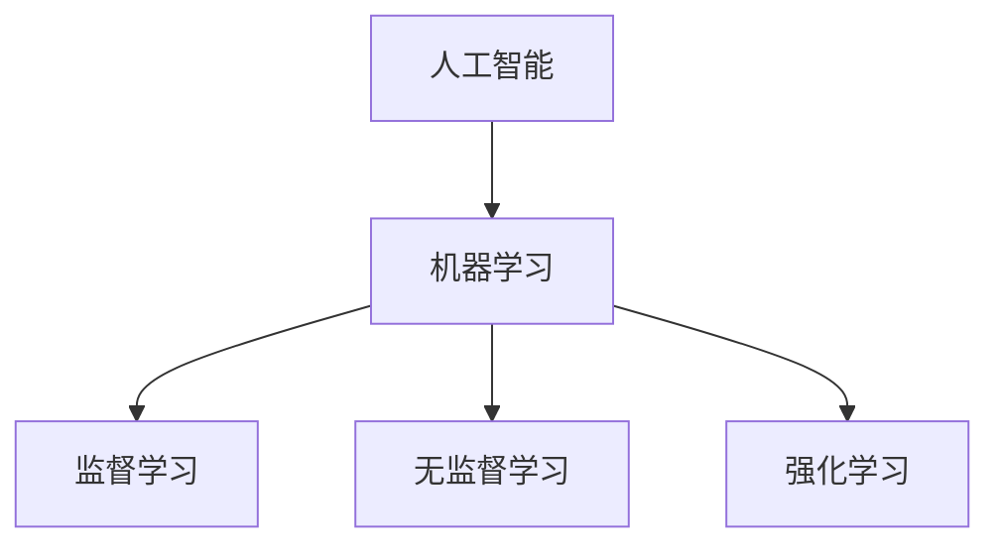
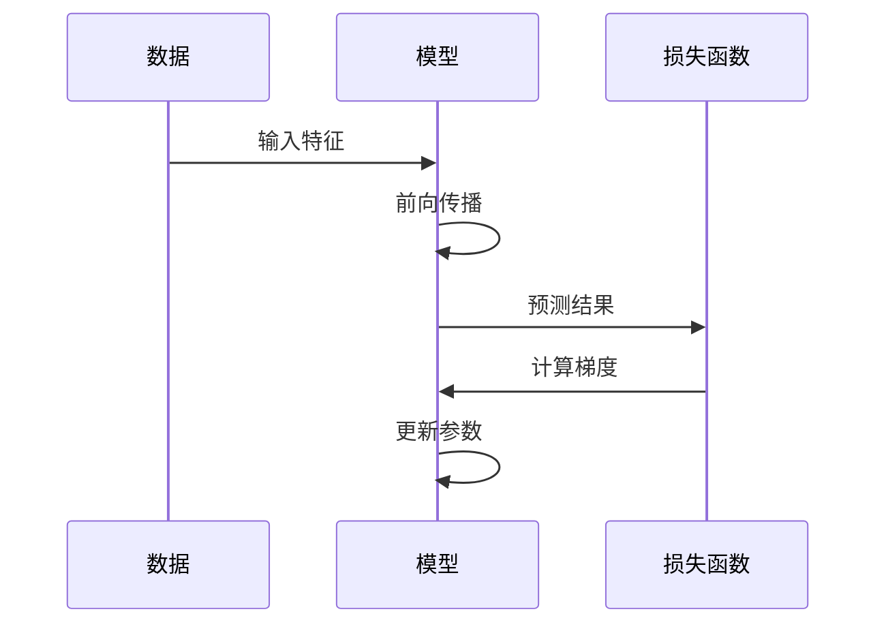
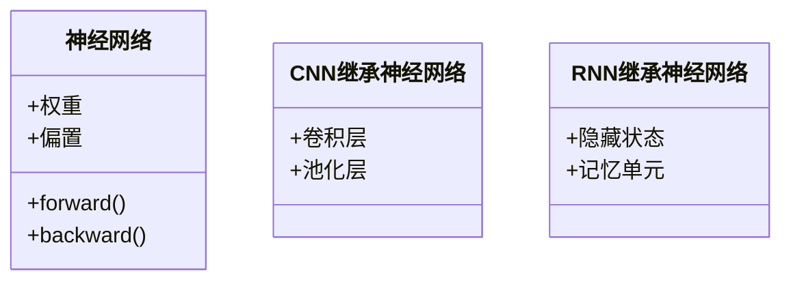
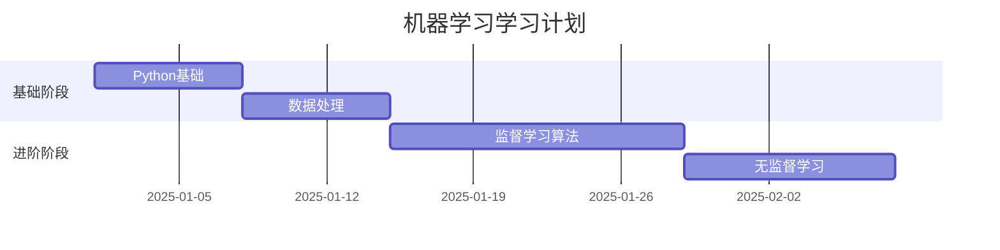
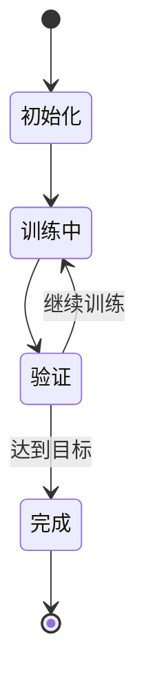
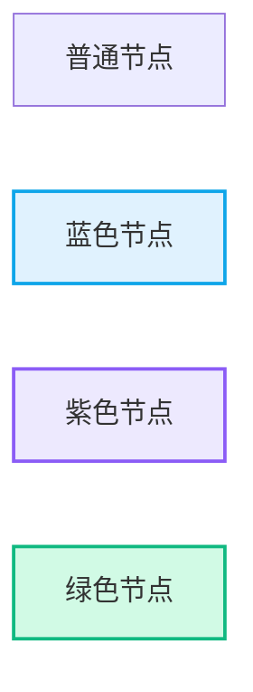
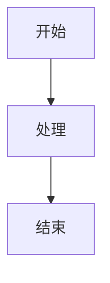

# 📊 Mermaid 图表支持 - 功能说明

## ✅ 已完成的功能

### 问题
课程内容中的示意图是纯文本ASCII字符图，不够直观和美观。

### 解决方案
✅ **集成 Mermaid 图表库**，支持在课程 Markdown 中直接渲染流程图、示意图、时序图等。

---

## 🎨 Mermaid 功能特点

### 1. 矢量图形
- 不是位图，是代码生成的矢量图
- 无论如何缩放都清晰
- 文件体积小

### 2. 可交互
- 可以点击、缩放
- 响应式布局
- 自动适配设备

### 3. 易维护
- 纯文本代码
- 易于版本控制
- 修改方便快捷

### 4. 风格统一
- 自定义主题配色
- 符合平台设计规范
- 蓝紫色系主题

---

## 📐 支持的图表类型

### 1. 流程图（Flowchart）


**适用场景**：
- 算法执行流程
- 决策过程
- 系统流程

---

### 2. 概念关系图（Graph）


**适用场景**：
- 概念层级关系
- 知识体系图谱
- 分类结构

---

### 3. 时序图（Sequence Diagram）


**适用场景**：
- 训练过程
- 数据流动
- 交互过程

---

### 4. 类图（Class Diagram）


**适用场景**：
- 模型架构
- 类继承关系
- 系统设计

---

### 5. 甘特图（Gantt）


**适用场景**：
- 学习计划
- 项目进度
- 时间安排

---

### 6. 状态图（State Diagram）


**适用场景**：
- 模型训练状态
- 系统状态转换
- 生命周期

---

## 🎨 自定义样式

### 主题配置
```javascript
{
  theme: 'default',
  themeVariables: {
    primaryColor: '#3B82F6',      // 蓝色
    primaryTextColor: '#1F2937',  // 深灰
    primaryBorderColor: '#2563EB',
    lineColor: '#8B5CF6',         // 紫色
    secondaryColor: '#8B5CF6',
    tertiaryColor: '#F3F4F6',
  }
}
```

### 节点样式


---

## 📝 使用方法

### 1. 在 Markdown 中使用

#### 语法格式
````markdown

````

#### 示例
**输入：**
````markdown

````

**输出：**


### 2. 样式自定义


---

## 🔧 技术实现

### 1. 安装依赖
```bash
npm install mermaid
```

### 2. 创建 Mermaid 组件
```typescript
// src/components/MermaidDiagram.tsx
import mermaid from 'mermaid'

export const MermaidDiagram = ({ chart }) => {
  // 渲染逻辑
}
```

### 3. 集成到 Markdown 渲染器
```typescript
// src/components/MarkdownViewer.tsx
code: ({ language, children }) => {
  if (language === 'mermaid') {
    return <MermaidDiagram chart={children} />
  }
  // 其他代码高亮...
}
```

---

## 📖 PRD 更新内容

### 新增内容规范（第七章 7.1）

#### 图表渲染要求
**所有课程内容中的图表必须使用 Mermaid 格式**

✅ **使用 Mermaid 的场景：**
- 流程图（算法流程）
- 概念关系图（AI/ML/DL关系）
- 时序图（训练过程）
- 类图（模型架构）
- 甘特图（学习计划）
- 状态图（状态转换）

❌ **禁止使用静态图片的场景：**
- 可以用 Mermaid 绘制的图表
- 简单的关系图、流程图

✅ **可以使用图片的场景：**
- 真实照片（示例图片）
- 复杂数学公式渲染
- 无法用 Mermaid 表达的特殊图表

#### 内容创作标准
- ✅ 使用 Mermaid 代码块（\`\`\`mermaid）
- ✅ 图表颜色符合主题配色（蓝色/紫色系）
- ✅ 节点命名简洁清晰（中文）
- ✅ 复杂图表添加注释说明

---

## 🎯 课程内容优化示例

### 优化前（纯文本）
```
传统编程：
输入数据 + 人工规则 → [计算机执行] → 输出结果

机器学习：
输入数据 + 正确答案 → [计算机学习] → 学到的模型
```

### 优化后（Mermaid）


**优势：**
- ✅ 视觉更清晰
- ✅ 关系更明确
- ✅ 美观专业
- ✅ 易于理解

---

## 📁 文件变更

### 新增文件
```
✓ src/components/MermaidDiagram.tsx     Mermaid渲染组件
✓ 📊Mermaid图表支持说明.md              功能说明文档
```

### 修改文件
```
✓ src/components/MarkdownViewer.tsx     集成Mermaid渲染
✓ PRD-机器学习教学平台.md               添加图表规范
✓ content/courses/module-1/lesson-01-什么是机器学习.md
  - 传统编程vs机器学习流程图（Mermaid）
  - AI/ML/DL关系图（Mermaid）
```

### 安装依赖
```
✓ mermaid                               图表渲染库
```

---

## 🧪 测试方法

### 1. 访问课程详情页
```
http://localhost:3000/courses/lesson-01
```

### 2. 查看图表渲染
- ✅ 流程对比图正确显示
- ✅ AI/ML/DL关系图正确显示
- ✅ 图表颜色符合主题
- ✅ 图表可交互（可拖动/缩放）

### 3. 测试不同类型图表
在课程中添加各种 Mermaid 图表类型，验证渲染效果。

---

## 📚 Mermaid 语法参考

### 流程图语法
```
flowchart TD/LR/BT/RL
    节点1[文字]
    节点2(圆角)
    节点3{菱形}
    节点4((圆形))
    
    节点1 --> 节点2
    节点2 -.虚线.-> 节点3
    节点3 ==>|粗线| 节点4
```

### 图方向
- `TD` - Top to Down（从上到下）
- `LR` - Left to Right（从左到右）
- `BT` - Bottom to Top（从下到上）
- `RL` - Right to Left（从右到左）

### 节点形状
- `[]` - 矩形
- `()` - 圆角矩形
- `{}` - 菱形
- `(())` - 圆形
- `>]` - 非对称矩形

### 连接线
- `-->` - 实线箭头
- `---` - 实线
- `-.->` - 虚线箭头
- `-.-` - 虚线
- `==>` - 粗线箭头
- `===` - 粗线

---

## 💡 最佳实践

### 1. 保持简洁
- 每个图表聚焦一个主题
- 避免过于复杂的图表
- 节点数量控制在 10 个以内

### 2. 命名清晰
- 使用中文描述
- 名称简短精确
- 避免歧义

### 3. 颜色协调
- 使用平台主题色
- 重要节点突出显示
- 避免过多颜色

### 4. 添加注释
- 复杂图表添加文字说明
- 解释特殊符号含义
- 标注关键路径

---

## 🌟 优势总结

### 对比传统图片
| 特性 | 传统图片 | Mermaid |
|------|----------|---------|
| **清晰度** | 依赖分辨率 | 矢量图，无限清晰 |
| **文件大小** | 较大 | 极小（纯文本） |
| **修改难度** | 需要重新制作 | 修改代码即可 |
| **版本控制** | 困难 | 友好（文本） |
| **响应式** | 需要多个尺寸 | 自动适配 |
| **可访问性** | 较差 | 可读屏 |
| **搜索** | 无法搜索 | 可搜索文字 |

---

## 🔮 未来扩展

### 可能的增强
- [ ] 图表交互功能（点击节点展开详情）
- [ ] 图表导出功能（PNG/SVG）
- [ ] 自定义图表主题切换
- [ ] 图表动画效果
- [ ] 图表编辑器（在线编辑）

---

## 📞 使用建议

### 内容创作者
1. **学习 Mermaid 基础语法**（10分钟入门）
2. **使用在线编辑器预览**（mermaid.live）
3. **遵循平台配色规范**（蓝紫色系）
4. **保持图表简洁易懂**

### 开发者
1. **测试各种图表类型**
2. **优化渲染性能**
3. **处理渲染错误**
4. **提供降级方案**

---

## ✅ 总结

### 已完成
✅ Mermaid 库集成  
✅ 渲染组件开发  
✅ Markdown 支持  
✅ 主题配置  
✅ 示例课程优化  
✅ PRD 文档更新  

### 效果
✅ 图表更直观美观  
✅ 维护更加方便  
✅ 风格统一专业  
✅ 用户体验提升  

---

**更新时间**：2025-10-29  
**版本**：v1.0  
**状态**：✅ 完成并测试

**现在课程中的图表都会以精美的 Mermaid 图表形式展示！** 🎨✨

立即访问查看效果：`http://localhost:3000/courses/lesson-01`

